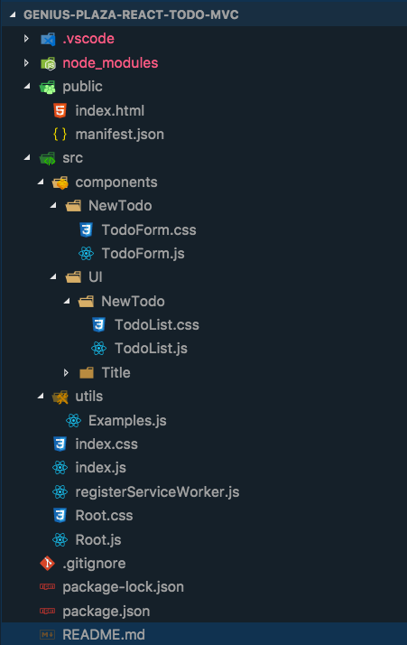

# TodoMVC (REACT)

## Resources
- [Website](https://react-todo-mvc.netlify.com/)

### Quick Overview
A live demo of the project [here](https://react-todo-mvc.netlify.com/)

The Structure of the Project looks like this: 

The folder structure and naming convention principles followed in this web app are born from this great article:
- [Structuring Projects and Naming Conventions](https://hackernoon.com/structuring-projects-and-naming-components-in-react-1261b6e18d76)

This can be a very opinionated subject, and I take in consideration that there is no absolute true in terms of structuring projects, but at least this spec article seems to give very good advice that made me to make slightly changes to the original requested folder structure for this project.

## Implementation
The Project was created from the create-react-app boilerplate. [link](https://github.com/facebook/create-react-app)
All data lives in the state of the `<Root />` Component and it's passed down as props to children components.

#### Empty to-dos title cannot be added.
In the `<Root />` Component lines 57-59 implement a `find() func` function that will search for a repeated title, if not found the `find() func` function returns undefined, this way we make sure we are not entering a repeated title.

#### Same to-dos title cannot be added.

To display the number of items the React-Pluralize library was used. For more info visit [react-pluralize](https://www.npmjs.com/package/react-pluralize)

#### Titles greater than 60 characters not allowed
The app could be developed into tasks title and description or details, but for time reasons I am only allowing titles no greater than 60 characters.

#### Try/Catch for Form errors
To catch errors on the `TodoForm.js` file, the React docs recommend to use the regular javascript try/catch. For more info please read: https://reactjs.org/docs/error-boundaries.html
And go to the section: How About Event Handlers?

#### Random suggestions for tasks
Every time the component re-render I show a random task example, this comes from an array of samples in the state of the `Root.js` Component.
The `utils` folder contains an `Examples.js` helper function that uses Math.random along with Math.floor to create a random number that will pull up 'randomnly' a new todo example.

#### AutoFocus
By using a `ref` on line 27 of the `TodoForm.js` Component and the life-cycle method `ComponentDidMount` the user is auto-focused to enter a new task every time they submit the form.

#### CSS
With much more time, a better UI/UX might be possible to implement, adding more features, and pleasant animations, transitions, etc for a better user experience. But I wanted to give some 'a little more than basic styling' to the app following some Boostrap 4 CSS principles. 

### Git workflow
The Git workflow used was inspired by the suggested article from the @devteam at Genius-Plaza. You can visit the master, develop, or any of the Feature branches to see every commit :) 

## Credit
Created by [Waldo Lavaut](waldothedeveloper@gmail.com)
